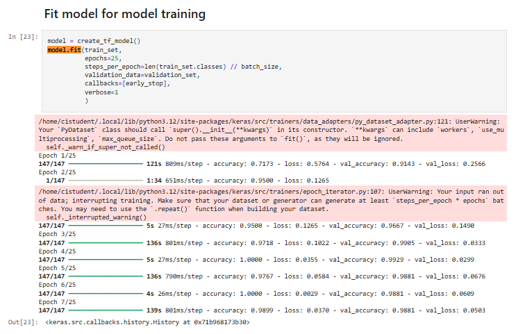

## Table of Contents

- [Table of Contents](#table-of-contents)
- [Introduction](#introduction)
- [Dataset Content](#dataset-content)
- [Business Requirements](#business-requirements)
  - [Specific requirements](#specific-requirements)
- [Hypotheses and Validation](#hypotheses-and-validation)
  - [Hypothesis 1](#hypothesis-1)
  - [Hypothesis 1 Validation](#hypothesis-1-validation)
- [Hypothesis 2](#hypothesis-2)
  - [Hypothesis 2 Validation](#hypothesis-2-validation)
  - [Hypothesis 3](#hypothesis-3)
  - [Hypothesis 3 Validation](#hypothesis-3-validation)
- [The Rationale to Map the Business Requirements to the Data Visualisations and ML Tasks](#the-rationale-to-map-the-business-requirements-to-the-data-visualisations-and-ml-tasks)
  - [Requirement 1: Visual Differentiation](#requirement-1-visual-differentiation)
  - [Requirement 2: Predictive Classification](#requirement-2-predictive-classification)
- [ML Business Case](#ml-business-case)
- [Dashboard Design](#dashboard-design)
  - [Home Page (Project Overview)](#home-page-project-overview)
  - [Visual Study Page](#visual-study-page)
  - [Mildew Detector Page (Make a Prediction)](#mildew-detector-page-make-a-prediction)
  - [Model Evaluation Page](#model-evaluation-page)
- [Bugs](#bugs)
  - [Previously Encountered and Resolved Bugs](#previously-encountered-and-resolved-bugs)
    - [File Format Validation](#file-format-validation)
    - [Dataset Structure](#dataset-structure)
    - [Upload File Handling](#upload-file-handling)
    - [Dataset Cleanup Error](#dataset-cleanup-error)
    - [Deployment Slug Size Challenge](#deployment-slug-size-challenge)
- [Deployment](#deployment)
  - [Deployment Process](#deployment-process)
    - [Important Deployment Notes](#important-deployment-notes)
- [Main Data Analysis and Machine Learning Libraries](#main-data-analysis-and-machine-learning-libraries)
- [Other Technologies Used](#other-technologies-used)
- [Testing](#testing)
  - [Manual Testing](#manual-testing)
    - [Business Requirements Testing](#business-requirements-testing)
  - [Notes](#notes)
  - [Responsiveness Testing](#responsiveness-testing)
  - [Notes on Responsiveness](#notes-on-responsiveness)
- [Python Validation](#python-validation)
  - [Jupyter Notebook Validation](#jupyter-notebook-validation)
  - [App Python File Validation](#app-python-file-validation)
  - [Conclusion](#conclusion)
- [Credits](#credits)
  - [Content](#content)
  - [Media](#media)
  - [Acknowledgements](#acknowledgements)

## Introduction

Farmy & Foods, a leading supplier of premium produce, has identified an operational bottleneck: manually inspecting cherry trees for signs of powdery mildew is time-consuming and unsustainable at scale. Employees currently spend up to 30 minutes per tree inspecting and treating leaves—limiting coverage across farms and delaying intervention.

This project explores the application of predictive analytics to automate the detection of mildew in cherry leaves using image classification. Leveraging a labeled dataset of cherry leaves, we build a dashboard that combines machine learning with visual tools to support early detection and inform decision-making.

The dashboard serves two primary business needs:

1. **Visual Differentiation** – Help users clearly distinguish between healthy and mildew-affected leaves.
2. **Predictive Classification** – Use a trained Convolutional Neural Network (CNN) to determine if an uploaded cherry leaf image is healthy or infected with mildew.

The solution was developed in Python using Jupyter notebooks and deployed using Streamlit on Render. A live version of the app may be found [here](https://project-mildew-detection.onrender.com)

## Dataset Content

The dataset is sourced from [Kaggle](https://www.kaggle.com/codeinstitute/cherry-leaves).

It contains over 4,000 images taken from Farmy & Foods’ cherry tree plantations. These images are divided into two categories: healthy cherry leaves and leaves infected with powdery mildew — a fungal disease known to affect many plant species. 

This crop represents one of the most valuable products in Farmy & Foods’ portfolio, and the client has expressed concerns that the outbreak of powdery mildew may be compromising both the quality of their product and their reputation in the market. The dataset serves as the foundation for building and validating a machine learning model to assist with large-scale, accurate diagnosis and quality control across their nationwide farms.

## Business Requirements

Farmy & Foods, a national agricultural company, is currently facing a significant challenge in maintaining the quality of their cherry crop due to an outbreak of powdery mildew — a fungal disease that affects the leaves of cherry trees.

At present, the company relies on a manual inspection process. Each tree is assessed visually by an employee, who samples a few leaves to determine whether powdery mildew is present. If mildew is detected, a fungicidal compound is applied. This inspection process takes approximately 30 minutes per tree, making it slow, labour-intensive, and ultimately unscalable given the thousands of trees across the company's farms.

To improve efficiency and reduce labour costs, Farmy & Foods has requested a machine learning (ML) solution capable of detecting powdery mildew from uploaded leaf images. This would allow for faster diagnosis and treatment, reducing crop loss and supporting quality control across large volumes of trees.

Key stakeholders include:

- **Farmy & Foods** — the client seeking a scalable inspection solution.
- **End customers** — who expect consistently high-quality produce.

To meet these business requirements, the solution must:

- Accurately classify cherry leaf images as **healthy** or **infected with powdery mildew**.
- Provide fast predictions suitable for real-time use.
- Be easy to understand and operate for both technical staff and field personnel.
- Offer visual insights to support the ML findings, including comparisons of healthy vs infected leaves.

### Specific requirements

1. Conduct a **visual study** to help the client understand the differences between healthy and infected leaves. This includes:
   - Sample montages of both leaf types
   - Average images for each class
   - Variability and difference images

2. Develop a **Convolutional Neural Network (CNN)** capable of predicting whether a given cherry leaf is healthy or infected with powdery mildew.

## Hypotheses and Validation

To guide development and ensure the project stays aligned with the business requirements, three hypotheses were proposed and tested. These hypotheses relate to the dataset, model behavior and prediction performance. They were validated through visual analysis, exploratory data techniques and machine learning metrics.

### Hypothesis 1

Our first hypothesis is that there is a clear visual distinction between healthy cherry leaves and those infected with powdery mildew. Specifically, we expect mildew-infected leaves to show a consistent pattern of pale patches or powdery appearance that is visually identifiable.

### Hypothesis 1 Validation

To validate this hypothesis, we conducted a detailed visual study using the images provided by Farmy & Foods. We examined multiple healthy and mildew-infected leaves, then generated average and variability images to highlight differences.

Below is a selection of healthy cherry leaves:


And below are examples of leaves affected by powdery mildew:


To quantify the visual patterns, we transformed each set into arrays and calculated both the **average image** and the **variability image** for each class:

**Healthy:**


**Powdery Mildew:**

 

From these visualisations and calculations, we observed clear and consistent differences. Healthy leaves had more consistent central colouring, while mildew-affected leaves showed irregular patches and higher variability.

These findings confirm the hypothesis: there is a visually detectable difference between healthy and mildew-infected leaves.

## Hypothesis 2

The trained CNN model can generalise well to unseen cherry leaf images.

Farmy & Foods would like confidence that the predictive model will work not only on the training data, but also on real-world images captured from their fields in the future. We hypothesise that our model, once trained, will retain high accuracy on a completely unseen test dataset, indicating good generalisation ability.

### Hypothesis 2 Validation

To validate this hypothesis, we trained the CNN model using the training and validation datasets. After training, we evaluated the model’s performance on the unseen test set.

We visualised the training accuracy/loss and validation accuracy/loss during model training. These plots show that the model converges with minimal overfitting:


Finally, we assessed the model’s generalisation ability using the separate test dataset. The model achieved high accuracy and low loss on the test set, supporting the hypothesis that it generalises well to unseen data.

Below is a screenshot showing the model's generalised performance on the test set:


Based on the training history and performance on the test set, the hypothesis is validated. The model successfully generalises to unseen images and is suitable for deployment in a real-world cherry leaf inspection system.

### Hypothesis 3

Using only a small number of training epochs will still allow the CNN model to achieve high accuracy.

Farmy & Foods would benefit from a fast, efficient model training pipeline. We hypothesize that due to the quality and consistency of the dataset, the model will not require many training epochs to reach high accuracy, saving time and computing resources.

### Hypothesis 3 Validation

To validate this, we monitored training and validation performance over a short number of epochs (7 or fewer). The plots below demonstrate how accuracy and loss quickly converge and stabilize, with minimal overfitting, supporting our hypothesis.



Based on the training curve, we can confirm that the model performs well within just a few epochs. This supports the hypothesis that fewer training epochs are sufficient, which is beneficial for future retraining or scaling the model to other crops.

## The Rationale to Map the Business Requirements to the Data Visualisations and ML Tasks

This section outlines how the project's user stories directly map to the client's business requirements, ensuring that both visual differentiation and predictive functionality needs were addressed.

A full list of User Stories can be found here:  
[View User Stories Project Board](https://github.com/users/JLG-96/projects/12/views/1)

### Requirement 1: Visual Differentiation

**Business Requirement:**  
The client is interested in conducting a study to visually differentiate a healthy cherry leaf from one with powdery mildew.

**Relevant User Stories:**

- **As a data scientist, I can collect and prepare image data so that it can be used for analysis and training ML models.**  
  - Dataset collected from Kaggle, validated to remove non-image files, and split into training, validation, and test sets.

- **As a data scientist, I can visualise healthy and infected cherry leaf images so that I can observe visual differences between them.**  
  - Created average images, variability images, and image montages for both healthy and infected leaves to support visual analysis.

- **As an end user, I can review a visual study page so that I can easily understand the key differences between healthy and infected leaves.**  
  - Built a Visual Study page in the dashboard to display side-by-side visualisations and comparison images.

### Requirement 2: Predictive Classification

**Business Requirement:**  
The client is interested in predicting if a cherry leaf is healthy or contains powdery mildew.

**Relevant User Stories:**

- **As a data scientist, I can build and train a CNN model to classify uploaded images as healthy or infected so that the client can automate leaf inspection.**  
  - Developed a Convolutional Neural Network (CNN) that achieved strong accuracy on unseen test data.

- **As an end user, I can upload an image of a cherry leaf so that I can instantly find out if it is healthy or infected with mildew.**  
  - Implemented a Mildew Detector page where users can upload an image and receive a classification prediction.

- **As an end user, I can review a model evaluation page so that I can view accuracy scores, loss charts, and confusion matrix performance.**  
  - Added a Model Evaluation page showing model training performance and test set results for transparency and trust.

## ML Business Case

The business objective is to automate and scale the detection of powdery mildew in cherry plantations, reducing time and labour costs and ensuring crop quality. Manual inspections are currently slow, costly and unscalable.

By implementing a machine learning solution based on Convolutional Neural Networks (CNNs), Farmy & Foods can instantly classify cherry leaf images as either healthy or infected. This enables early intervention and protects their premium crop quality.

**Key Points:**

- **Objective:** Develop a predictive model to classify cherry leaves as healthy or infected with mildew.
- **Method:** Train a Convolutional Neural Network (CNN) using a labelled dataset of cherry leaf images sourced from Kaggle.
- **Desired Outcome:** Achieve high classification accuracy and reliable performance on unseen data to support real-time decision-making.
- **Impact:**  
  - Dramatically reduce manual inspection time.  
  - Enable fast, scalable inspections across multiple farms.  
  - Protect the client’s reputation for high-quality produce.
- **Limitations:**  
  - The model is designed to classify only cherry leaves as either healthy or infected.  
  - If non-cherry leaf images are uploaded, the model may still attempt a classification, as it does not include a rejection mechanism.

This machine learning approach directly addresses the client's business requirements by supporting both visual differentiation and instant prediction of leaf health.

## Dashboard Design

The Streamlit dashboard was built with accessibility and clarity as primary goals. It consists of four key pages, each aligned with the business requirements and user stories outlined earlier.

### Home Page (Project Overview)

The Home page provides a summary of the project's objectives and instructions for using the dashboard. It outlines the background of Farmy & Foods' cherry plantation issue and guides the user on how to navigate through the dashboard pages effectively.


### Visual Study Page

The Visual Study page enables users to visually explore differences between healthy and mildew-affected cherry leaves. It includes image montages, average images for each class, and a difference image that highlights key areas of variation. This supports the first business requirement by allowing users to visually differentiate between healthy and infected leaves.


### Mildew Detector Page (Make a Prediction)

The Mildew Detector page provides an interactive feature where users can upload a leaf image to receive an immediate prediction. The model outputs whether the leaf is classified as "healthy" or "powdery mildew" along with a prediction probability chart.

This page directly addresses the second business requirement by enabling real-time prediction and scalable disease detection.

Users who do not have their own images can also download sample healthy and infected cherry leaf images for testing purposes via the link provided on the Mildew Detector page or, directly from [here](https://www.kaggle.com/datasets/codeinstitute/cherry-leaves).


### Model Evaluation Page

The Model Evaluation page provides transparency on the model's performance. It displays training and validation accuracy and loss curves, a confusion matrix, and final test set performance results. This gives users confidence in the model's reliability and highlights the model's ability to generalise to unseen data.


## Bugs

At the time of submission, no active bugs are present. All app functionality, dashboard pages, and machine learning tasks operate as intended.

### Previously Encountered and Resolved Bugs

#### File Format Validation

- **Problem:**  
  Non-image files (e.g., JSON or system files) were initially present within the dataset, causing errors during model training.

- **Cause:**  
  The dataset download contained mixed file types that were not filtered before training.

- **Solution:**  
  The dataset was cleaned to include only `.jpg` images, ensuring compatibility with the TensorFlow image data pipeline.

- **Outcome:**  
  Model training proceeded successfully without further format-related interruptions.

#### Dataset Structure

- **Problem:**  
  During early data exploration, a mismatch between folder names and labels caused confusion and training errors.

- **Cause:**  
  The original dataset had some inconsistencies in folder naming and structure that misaligned with Keras directory-based loading.

- **Solution:**  
  The dataset was reorganized to clearly separate `healthy` and `powdery_mildew` images into appropriate subfolders.

- **Outcome:**  
  Data generators were able to correctly label and load the images, allowing training and evaluation to proceed correctly.

#### Upload File Handling

- **Problem:**  
  A deprecation warning was triggered during image uploads through Streamlit.

- **Cause:**  
  The app was using outdated Streamlit syntax for file uploaders.

- **Solution:**  
  The code was updated to use the latest supported `st.file_uploader()` syntax, preventing future compatibility issues.

- **Outcome:**  
  File uploads now function correctly without warnings, and the app is future-proofed for newer Streamlit versions.

#### Dataset Cleanup Error

- **Problem:**  
  An `IsADirectoryError` occurred during the dataset cleanup phase when the script attempted to delete directories instead of files.

- **Cause:**  
  The script incorrectly assumed all items returned by `os.listdir()` were files, but folders such as `healthy` and `powdery_mildew` were also present.

- **Solution:**  
  The cleanup code was updated to use `os.walk()`, properly identifying and targeting only files for deletion.

- **Outcome:**  
  The dataset was fully cleaned and validated for modelling.

#### Deployment Slug Size Challenge

- **Problem:**  
  Deployment to Heroku failed because the compiled slug exceeded the platform's 500MB limit.

- **Cause:**  
  Large files such as datasets, test notebooks, and unused directories were being included in the Heroku build.

- **Solution:**  
  A `.slugignore` file was implemented to exclude unnecessary files, and deployment was migrated to Render, which offers higher size allowances.

- **Outcome:**  
  The app was successfully deployed using Render and now operates reliably without size issues.

## Deployment

This project was deployed to [Render](https://render.com) using their free tier hosting service.

The live web application can be accessed here:  
**[https://project-mildew-detection.onrender.com](https://project-mildew-detection.onrender.com)**

---

### Deployment Process

The following steps were used to deploy the project:

1. Log in to render and click the **+ New** in the top right corner. Select **Web Service**.

   - Choose **"Connect account"** and authorize access to GitHub if not already connected.

2. Select the correct repository from the list.

   - Ensure the following settings match:


3. Set the **Build Command:**

  ```bash
  pip install -r requirements.txt && ./setup.sh
  ```

4. Set the **Start Command:**

  ```bash
  streamlit run app.py
  ```

5. Ensure the Free plan $0/month is selected.

6. Set the following environment variables:
   - Add a key: PORT and a value: 8501
   - Add a second environment variable with a key: PYTHON_VERSION and value: 3.8.12


7. Set to auto-deploy.

   - The site will deploy every time a commit is pushed to the GitHub repository.
   - Build hours are limited to 750 hours/month, it is unlikely but not impossible to reach that limit.

8. In order to deploy:

   - You must now click **Create Web Service**
   - Watch the console for some activity, deployment can take up to 15 minutes to complete
   - When the build and deployment have completed, the console will look something like this:


9. Access the app:

   - You will then be provided a URL at the top of the page which will allow you to access the app.
   - The URL for this live app is; **[https://project-mildew-detection.onrender.com](https://project-mildew-detection.onrender.com)**

#### Important Deployment Notes

- **Cold Starts:**  
  On Render’s free plan, if the app is inactive for a while, it can take 30–60 seconds to restart when first accessed.
- **Slug Size:**  
  Unlike Heroku, Render’s free service does not have strict slug size limits, making it suitable for image-heavy machine learning projects.

  ## Main Data Analysis and Machine Learning Libraries

The following libraries were essential for project development:

- **os** – File and directory operations  
- **shutil** – File and directory operations  
- **Pillow (PIL) 10.0.1** – Loading and validating images for analysis  
- **numpy 1.26.1** – Array manipulation, image averaging, and difference calculations  
- **pandas 2.1.1** – Data handling and dataset structuring  
- **matplotlib 3.4.0** – Creating static visualisations such as image previews and probability charts  
- **seaborn 0.13.2** – Statistical visualisations (limited use for correlation plots)  
- **plotly 5.10.0** – Interactive plotting for model performance metrics  
- **tensorflow-cpu 2.16.1** – CNN model creation, training, and evaluation  
- **keras 3.0.0** – Model hyperparameter tuning and callbacks  
- **scikit-learn 1.3.1** – Model evaluation tools including confusion matrix and classification report  
- **streamlit 1.40.2** – Web application framework for building an interactive dashboard  
- **joblib 1.4.2** – Efficient model saving and parallel computation where needed

## Other Technologies Used

- **Streamlit:** Used to develop the multi-page dashboard and build the interactive front-end for the project.
- **Render:** Used to deploy the finished app as a live web application.
- **Git & GitHub:** Used for version control, project collaboration, and code repository management.
- **GitHub Codespaces:** Used as the Integrated Development Environment (IDE) for project development and testing.
- **Am I Responsive:** Used to generate responsiveness preview screenshots for documentation.


## Testing

### Manual Testing

#### Business Requirements Testing

**Requirement 1:**  
The client requested a visual study to differentiate healthy cherry leaves from those affected by powdery mildew.

- As a data scientist, I can collect and prepare cherry leaf data so that it can be used for analysis and training ML models.
- As a data scientist, I can visualise healthy and infected cherry leaf images so that I can observe visual differences between them.
- As an end user, I can review a visual study page so that I can easily understand the key differences between healthy and infected leaves.

| Dashboard Item | Test Conducted | Expected Result | Actual Result |
|----------------|----------------|-----------------|---------------|
| Navbar         | Selecting Visual Study page | Visual Study page opens | Success |
| Image Montage Button | Click button | See image montage options appear | Success |
| Average Image Button | Click button | See average images for healthy and mildew leaves | Success |
| Difference Image Button | Click button | See difference between healthy and infected leaves | Success |

---

**Requirement 2:**  
The client requested a predictive tool to classify uploaded cherry leaf images.

- As a data scientist, I can build and train a CNN model to classify uploaded images as healthy or infected so that the client can automate leaf inspection.
- As an end user, I can upload an image of a cherry leaf so that I can instantly find out if it is healthy or infected with mildew.
- As an end user, I can review a model evaluation page so that I can view accuracy scores, loss charts, and confusion matrix performance.

| Dashboard Item | Test Conducted | Expected Result | Actual Result |
|----------------|----------------|-----------------|---------------|
| Navbar         | Selecting Mildew Detector page | Mildew Detector page opens | Success |
| Link to Kaggle Sample Images | Click link | Kaggle page for sample images opens | Success |
| Upload Box | Drag and drop image | Image uploaded successfully and analyzed | Success |
| Upload Box | Browse files and upload | Image uploaded successfully and analyzed | Success |
| Prediction Output | Check prediction label and probability chart | Correct prediction label and chart displayed | Success |
| Image Analysis Report | Click download report | CSV file downloaded successfully | Success |

| Dashboard Item | Test Conducted | Expected Result | Actual Result |
|----------------|----------------|-----------------|---------------|
| Navbar         | Selecting Model Evaluation page | Model Evaluation page opens | Success |
| Metrics Display | View metrics | Accuracy, Loss, and Confusion Matrix display correctly | Success |

---

### Notes

- All testing was conducted manually by uploading leaf images from both the healthy and powdery mildew datasets.
- Testing confirmed that all major functions (navigation, file upload, prediction, and performance visualization) work correctly across all tested devices.
- No critical bugs were encountered during final manual testing.


### Responsiveness Testing

The application was manually tested across multiple devices and screen sizes to ensure a consistent user experience:

| Device / Screen Size | Testing Conducted | Expected Result | Actual Result |
|----------------------|-------------------|-----------------|---------------|
| Desktop (Windows, Chrome) | Full site navigation, uploads, predictions, and downloads | All features work correctly | Success |
| Laptop (Windows, Edge) | Full dashboard interaction | No layout issues | Success |
| iPad (Safari) | Navigation, file upload, and prediction tested | Layout adjusts to tablet screen, upload button accessible | Success |
| iPhone (Safari) | Navigation and text readability tested | Content readable, upload and prediction still functional | Success |

---

### Notes on Responsiveness

- Streamlit's built-in layout system ensured good responsiveness without requiring external libraries like Bootstrap.
- Minor adjustments were made to component placement (e.g., spacing on Visual Study page) to optimize mobile readability.
- No horizontal scrolling or major layout breaks were observed during testing.

## Python Validation

All Python code used in this project was validated to ensure correctness and alignment with PEP8 styling where possible.

### Jupyter Notebook Validation

The three Jupyter notebooks were validated using `pycodestyle_magic`. The following steps were taken:

1. Installed the necessary extension:

   ```python
   !pip install pycodestyle_magic
   ```

2. At the top of each notebook, the following commands were run:

  ```python
  %load_ext pycodestyle_magic
  %pycodestyle_on
  ```

3. After running all cells, the notebooks showed no execution errors. Minor PEP8 warnings were raised regarding:

Missing whitespace around operators (E225)

Lines exceeding 79 characters (E501)

These minor style warnings did not affect the functionality or logic of the code, and were deemed acceptable for the purposes of this project.

### App Python File Validation

The main application files (app.py and files in the app_pages directory) were reviewed for PEP8 compliance using a PEP8 linter.

No critical errors were found, and the application runs without issue. Minor style warnings (e.g., line length) were similarly noted but did not require urgent correction.

### Conclusion

All critical Python code was validated and runs correctly. Minor style warnings were documented but did not affect the performance, clarity, or correctness of the project.

## Credits

### Content

- The dataset was provided by **Code Institute** and accessed through [Kaggle](https://www.kaggle.com/datasets/codeinstitute/cherry-leaves).
- The **Cherry Leaves** project brief was set by **Code Institute** as part of the Predictive Analytics module.
- Inspiration and guidance for structuring the project was drawn from the **Malaria Walkthrough Project** provided by Code Institute.
- Influence for README structure project organization came from [Hugh Keenan](https://github.com/HughKeenan/CherryPicker/tree/main?tab=readme-ov-file#hypotheses).
- Additional support, guidance and technical troubleshooting was provided via the **Slack Community** and **Stack Overflow**.

### Media

- All images used in the dashboard come from the original Kaggle cherry leaf dataset.
- Test images for app functionality (uploaded during manual testing) were also sourced from the same dataset.
- Streamlit page icons were accessed from [Streamlit Emoji Shortcodes](https://streamlit-emoji-shortcodes-streamlit-app-gwckff.streamlit.app/).

### Acknowledgements

- Special thanks to my mentor, **Mo Shami**, for invaluable guidance and feedback throughout the project.
- Thanks to the **Slack Community** for assistance with technical issues and deployment troubleshooting.
