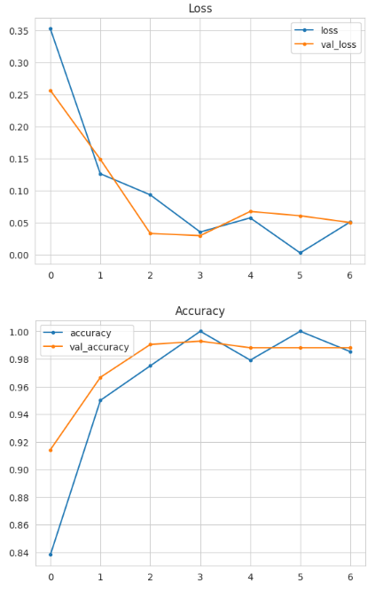

## Table of Contents

- [Table of Contents](#table-of-contents)
- [Introduction](#introduction)
- [Dataset Content](#dataset-content)
- [Business Requirements](#business-requirements)
  - [Specific requirements](#specific-requirements)
- [Hypotheses and Validation](#hypotheses-and-validation)
  - [Hypothesis 1](#hypothesis-1)
  - [Hypothesis 1 Validation](#hypothesis-1-validation)
- [Hypothesis 2](#hypothesis-2)
  - [Hypothesis 2 Validation](#hypothesis-2-validation)
  - [Hypothesis 3](#hypothesis-3)
  - [Hypothesis 3 Validation](#hypothesis-3-validation)
- [The Rationale to Map the Business Requirements to the Data Visualisations and ML Tasks](#the-rationale-to-map-the-business-requirements-to-the-data-visualisations-and-ml-tasks)
  - [Requirement 1: Visual Differentiation](#requirement-1-visual-differentiation)
  - [Requirement 2: Predictive Classification](#requirement-2-predictive-classification)
- [ML Business Case](#ml-business-case)
- [Dashboard Design](#dashboard-design)
  - [Home Page (Project Overview)](#home-page-project-overview)
  - [Visual Study Page](#visual-study-page)
  - [Mildew Detector Page (Make a Prediction)](#mildew-detector-page-make-a-prediction)
  - [Model Evaluation Page](#model-evaluation-page)
- [Dashboard Design](#dashboard-design-1)
- [Bugs](#bugs)
  - [IsADirectoryError During Dataset Cleanup](#isadirectoryerror-during-dataset-cleanup)
  - [Slug Size / Deployment Challenges](#slug-size--deployment-challenges)
- [Deployment](#deployment)
  - [Render](#render)
  - [Notes on Deployment:](#notes-on-deployment)
  - [Deployment Steps on Render:](#deployment-steps-on-render)
- [Main Data Analysis and Machine Learning Libraries](#main-data-analysis-and-machine-learning-libraries)
- [Notebook Overviews](#notebook-overviews)
  - [`01 - DataCollection.ipynb`](#01---datacollectionipynb)
  - [`02 - DataVisualization.ipynb`](#02---datavisualizationipynb)
  - [`03 - Modelling and Evaluating.ipynb`](#03---modelling-and-evaluatingipynb)
- [Source Code Structure](#source-code-structure)
- [App Testing](#app-testing)
- [Future Improvements](#future-improvements)
- [Credits](#credits)
  - [Content](#content)
  - [Media](#media)
- [Acknowledgements](#acknowledgements)

## Introduction

Farmy & Foods, a leading supplier of premium produce, has identified an operational bottleneck: manually inspecting cherry trees for signs of powdery mildew is time-consuming and unsustainable at scale. Employees currently spend up to 30 minutes per tree inspecting and treating leaves—limiting coverage across farms and delaying intervention.

This project explores the application of predictive analytics to automate the detection of mildew in cherry leaves using image classification. Leveraging a labeled dataset of cherry leaves, we build a dashboard that combines machine learning with visual tools to support early detection and inform decision-making.

The dashboard serves two primary business needs:

1. **Visual Differentiation** – Help users clearly distinguish between healthy and mildew-affected leaves.
2. **Predictive Classification** – Use a trained Convolutional Neural Network (CNN) to determine if an uploaded cherry leaf image is healthy or infected with mildew.

The solution was developed in Python using Jupyter notebooks and deployed using Streamlit on Render. A live version of the app may be found [here](https://project-mildew-detection.onrender.com)

## Dataset Content

The dataset is sourced from [Kaggle](https://www.kaggle.com/codeinstitute/cherry-leaves).

It contains over 4,000 images taken from Farmy & Foods’ cherry tree plantations. These images are divided into two categories: healthy cherry leaves and leaves infected with powdery mildew — a fungal disease known to affect many plant species. 

This crop represents one of the most valuable products in Farmy & Foods’ portfolio, and the client has expressed concerns that the outbreak of powdery mildew may be compromising both the quality of their product and their reputation in the market. The dataset serves as the foundation for building and validating a machine learning model to assist with large-scale, accurate diagnosis and quality control across their nationwide farms.

## Business Requirements

Farmy & Foods, a national agricultural company, is currently facing a significant challenge in maintaining the quality of their cherry crop due to an outbreak of powdery mildew — a fungal disease that affects the leaves of cherry trees.

At present, the company relies on a manual inspection process. Each tree is assessed visually by an employee, who samples a few leaves to determine whether powdery mildew is present. If mildew is detected, a fungicidal compound is applied. This inspection process takes approximately 30 minutes per tree, making it slow, labour-intensive, and ultimately unscalable given the thousands of trees across the company's farms.

To improve efficiency and reduce labour costs, Farmy & Foods has requested a machine learning (ML) solution capable of detecting powdery mildew from uploaded leaf images. This would allow for faster diagnosis and treatment, reducing crop loss and supporting quality control across large volumes of trees.

Key stakeholders include:

- **Farmy & Foods** — the client seeking a scalable inspection solution.
- **End customers** — who expect consistently high-quality produce.

To meet these business requirements, the solution must:

- Accurately classify cherry leaf images as **healthy** or **infected with powdery mildew**.
- Provide fast predictions suitable for real-time use.
- Be easy to understand and operate for both technical staff and field personnel.
- Offer visual insights to support the ML findings, including comparisons of healthy vs infected leaves.

### Specific requirements

1. Conduct a **visual study** to help the client understand the differences between healthy and infected leaves. This includes:
   - Sample montages of both leaf types
   - Average images for each class
   - Variability and difference images

2. Develop a **Convolutional Neural Network (CNN)** capable of predicting whether a given cherry leaf is healthy or infected with powdery mildew.

## Hypotheses and Validation

To guide development and ensure the project stays aligned with the business requirements, three hypotheses were proposed and tested. These hypotheses relate to the dataset, model behavior and prediction performance. They were validated through visual analysis, exploratory data techniques and machine learning metrics.

### Hypothesis 1

Our first hypothesis is that there is a clear visual distinction between healthy cherry leaves and those infected with powdery mildew. Specifically, we expect mildew-infected leaves to show a consistent pattern of pale patches or powdery appearance that is visually identifiable.

### Hypothesis 1 Validation

To validate this hypothesis, we conducted a detailed visual study using the images provided by Farmy & Foods. We examined multiple healthy and mildew-infected leaves, then generated average and variability images to highlight differences.

Below is a selection of healthy cherry leaves:


And below are examples of leaves affected by powdery mildew:


To quantify the visual patterns, we transformed each set into arrays and calculated both the **average image** and the **variability image** for each class:

**Healthy:**


**Powdery Mildew:**

 

From these visualisations and calculations, we observed clear and consistent differences. Healthy leaves had more consistent central colouring, while mildew-affected leaves showed irregular patches and higher variability.

These findings confirm the hypothesis: there is a visually detectable difference between healthy and mildew-infected leaves.

## Hypothesis 2

The trained CNN model can generalise well to unseen cherry leaf images.

Farmy & Foods would like confidence that the predictive model will work not only on the training data, but also on real-world images captured from their fields in the future. We hypothesise that our model, once trained, will retain high accuracy on a completely unseen test dataset, indicating good generalisation ability.

### Hypothesis 2 Validation

To validate this hypothesis, we trained the CNN model using the training and validation datasets. After training, we evaluated the model’s performance on the unseen test set.

We visualised the training accuracy/loss and validation accuracy/loss during model training. These plots show that the model converges with minimal overfitting:


Finally, we assessed the model’s generalisation ability using the separate test dataset. The model achieved high accuracy and low loss on the test set, supporting the hypothesis that it generalises well to unseen data.

Below is a screenshot showing the model's generalised performance on the test set:


Based on the training history and performance on the test set, the hypothesis is validated. The model successfully generalises to unseen images and is suitable for deployment in a real-world cherry leaf inspection system.

### Hypothesis 3

Using only a small number of training epochs will still allow the CNN model to achieve high accuracy.

Farmy & Foods would benefit from a fast, efficient model training pipeline. We hypothesize that due to the quality and consistency of the dataset, the model will not require many training epochs to reach high accuracy, saving time and computing resources.

### Hypothesis 3 Validation

To validate this, we monitored training and validation performance over a short number of epochs (7 or fewer). The plots below demonstrate how accuracy and loss quickly converge and stabilize, with minimal overfitting, supporting our hypothesis.



Based on the training curve, we can confirm that the model performs well within just a few epochs. This supports the hypothesis that fewer training epochs are sufficient, which is beneficial for future retraining or scaling the model to other crops.

## The Rationale to Map the Business Requirements to the Data Visualisations and ML Tasks

This section outlines how the project's user stories directly map to the client's business requirements, ensuring that both visual differentiation and predictive functionality needs were addressed.

A full list of User Stories can be found here:  
[View User Stories Project Board](https://github.com/users/JLG-96/projects/12/views/1)

### Requirement 1: Visual Differentiation

**Business Requirement:**  
The client is interested in conducting a study to visually differentiate a healthy cherry leaf from one with powdery mildew.

**Relevant User Stories:**

- **As a data scientist, I can collect and prepare image data so that it can be used for analysis and training ML models.**  
  - Dataset collected from Kaggle, validated to remove non-image files, and split into training, validation, and test sets.

- **As a data scientist, I can visualise healthy and infected cherry leaf images so that I can observe visual differences between them.**  
  - Created average images, variability images, and image montages for both healthy and infected leaves to support visual analysis.

- **As an end user, I can review a visual study page so that I can easily understand the key differences between healthy and infected leaves.**  
  - Built a Visual Study page in the dashboard to display side-by-side visualisations and comparison images.

### Requirement 2: Predictive Classification

**Business Requirement:**  
The client is interested in predicting if a cherry leaf is healthy or contains powdery mildew.

**Relevant User Stories:**

- **As a data scientist, I can build and train a CNN model to classify uploaded images as healthy or infected so that the client can automate leaf inspection.**  
  - Developed a Convolutional Neural Network (CNN) that achieved strong accuracy on unseen test data.

- **As an end user, I can upload an image of a cherry leaf so that I can instantly find out if it is healthy or infected with mildew.**  
  - Implemented a Mildew Detector page where users can upload an image and receive a classification prediction.

- **As an end user, I can review a model evaluation page so that I can view accuracy scores, loss charts, and confusion matrix performance.**  
  - Added a Model Evaluation page showing model training performance and test set results for transparency and trust.

## ML Business Case

The business objective is to automate and scale the detection of powdery mildew in cherry plantations, reducing time and labour costs and ensuring crop quality. Manual inspections are currently slow, costly and unscalable.

By implementing a machine learning solution based on Convolutional Neural Networks (CNNs), Farmy & Foods can instantly classify cherry leaf images as either healthy or infected. This enables early intervention and protects their premium crop quality.

**Key Points:**

- **Objective:** Develop a predictive model to classify cherry leaves as healthy or infected with mildew.
- **Method:** Train a Convolutional Neural Network (CNN) using a labelled dataset of cherry leaf images sourced from Kaggle.
- **Desired Outcome:** Achieve high classification accuracy and reliable performance on unseen data to support real-time decision-making.
- **Impact:**  
  - Dramatically reduce manual inspection time.  
  - Enable fast, scalable inspections across multiple farms.  
  - Protect the client’s reputation for high-quality produce.
- **Limitations:**  
  - The model is designed to classify only cherry leaves as either healthy or infected.  
  - If non-cherry leaf images are uploaded, the model may still attempt a classification, as it does not include a rejection mechanism.

This machine learning approach directly addresses the client's business requirements by supporting both visual differentiation and instant prediction of leaf health.

## Dashboard Design

The Streamlit dashboard was built with accessibility and clarity as primary goals. It consists of four key pages, each aligned with the business requirements and user stories outlined earlier.

### Home Page (Project Overview)

The Home page provides a summary of the project's objectives and instructions for using the dashboard. It outlines the background of Farmy & Foods' cherry plantation issue and guides the user on how to navigate through the dashboard pages effectively.


### Visual Study Page

The Visual Study page enables users to visually explore differences between healthy and mildew-affected cherry leaves. It includes image montages, average images for each class, and a difference image that highlights key areas of variation. This supports the first business requirement by allowing users to visually differentiate between healthy and infected leaves.


### Mildew Detector Page (Make a Prediction)

The Mildew Detector page provides an interactive feature where users can upload a leaf image to receive an immediate prediction. The model outputs whether the leaf is "healthy" or "powdery mildew" along with a prediction probability chart. This page directly addresses the second business requirement by enabling real-time prediction and scalable disease detection.


**Sample Images for Prediction:**

To test the Mildew Detector, users can download sample healthy and infected cherry leaf images from the original Kaggle dataset:

[Cherry Leaves Dataset](https://www.kaggle.com/datasets/codeinstitute/cherry-leaves)

### Model Evaluation Page

The Model Evaluation page provides transparency on the model's performance. It displays training and validation accuracy and loss curves, a confusion matrix, and final test set performance results. This gives users confidence in the model's reliability and highlights the model's ability to generalise to unseen data.


---

---
---
---
---
---
---
---
---
---
---
---
---
---


## Dashboard Design

- Planned

| Page              | Content                                                                 |
|------------------|-------------------------------------------------------------------------|
| Home             | Project overview and instructions                                       |
| Model Prediction | Image uploader and prediction result display                            |
| Model Evaluation | Training accuracy/loss, confusion matrix, classification report         |
| Visual Study     | Shows sample healthy and mildew-affected leaves. Includes image montage, average image comparisons, and pixel-level difference image. Supports visual differentiation goal. |

> Note: All planned dashboard pages have been implemented using `Streamlit`.

## Bugs

### IsADirectoryError During Dataset Cleanup

- **Issue:** While attempting to remove non-image files from the dataset, the script triggered an `IsADirectoryError` because it attempted to delete folders instead of files.
- **Why it occurred:** The initial implementation used `os.listdir()` and assumed all items were files, but some were directories (e.g., `healthy`, `powdery_mildew` subfolders).
- **How it was resolved:** The file removal function was updated to use `os.walk()`, which recursively iterates through all directories and ensures only files are targeted for deletion.
- **Outcome:** The issue was resolved successfully, and the cleaned dataset is now verified and usable for further analysis.

### Slug Size / Deployment Challenges

- **Issue:** Initial deployment to Heroku failed due to the compiled slug exceeding the 500MB limit.
- **Why it occurred:** The project included large directories and unnecessary files (e.g., image datasets, test data, notebooks).
- **How it was resolved:** A `.slugignore` file was created to exclude folders and files not required to run the Streamlit app.
- **Outcome:** Deployment succeeded after switching to Render, which allows for larger project sizes and simpler configuration using a start command.

## Deployment

### Render

This project was deployed using [Render](https://render.com) on their free tier. The live web application can be accessed here:  
**[https://project-mildew-detection.onrender.com](https://project-mildew-detection.onrender.com)**

### Notes on Deployment:

- The app may take up to 30–60 seconds to load if it hasn't been accessed recently. This is due to cold starts on the free Render tier.
- Once the application loads, it performs as expected.

### Deployment Steps on Render:

1. Create a free account at [render.com](https://render.com).
2. Connect your GitHub repository to Render.
3. Create a new **Web Service**, selecting the correct repository.
4. Set the following options during configuration:
   - **Build Command:**  
     ```
     pip install -r requirements.txt && ./setup.sh
     ```
   - **Start Command:**  
     ```
     streamlit run app.py --server.address=0.0.0.0 --server.port=10000
     ```
5. Specify the Python version (e.g. `3.10.12`) using a `runtime.txt` file or a `PYTHON_VERSION` environment variable.
6. Click deploy and wait for the build process to complete.

## Main Data Analysis and Machine Learning Libraries

- `os`, `shutil`: File and directory operations
- `Pillow (PIL)`: Image loading and validation
- `numpy`: Used to calculate average and difference images, and format model input
- `matplotlib.pyplot`: Used for image display and prediction probability charts
- `tensorflow.keras`: For CNN model creation and prediction
- `streamlit`: To build an interactive user interface

## Notebook Overviews

### `01 - DataCollection.ipynb`

This notebook is responsible for loading and preparing the dataset for modelling. It includes:

- Verification and cleanup of the image directory
- Validation that all image files are in a supported format
- Splitting the dataset into `train`, `validation`, and `test` folders
- Setting the file structure required for training image classification models
- Summary cell outlining the conclusions and next steps

This notebook supports the business requirement by ensuring a high-quality and well-organised dataset for downstream machine learning tasks.

---

### `02 - DataVisualization.ipynb`

This notebook explores and visualises the image data. It includes:

- Calculation of image dimensions (width, height) across the dataset
- Image montage previewing healthy vs mildew-affected leaves
- Average image and pixel-level difference between healthy and mildew categories
- Confirmed image consistency and verified class balance
- Final markdown cell includes conclusions and next steps

This notebook supports the first business requirement by visually highlighting differences between healthy and infected leaves and confirming the dataset is balanced and suitable for modelling.

---

### `03 - Modelling and Evaluating.ipynb`

This notebook builds, trains, and evaluates a Convolutional Neural Network (CNN). It includes:

- Data augmentation using `ImageDataGenerator`
- CNN model creation and compilation using `tensorflow.keras`
- Application of early stopping to prevent overfitting
- Evaluation using test data, accuracy/loss curves, and a confusion matrix
- Saving the model and test performance metrics
- Concludes with model evaluation on unseen test data, saving accuracy/loss to a JSON file for dashboard integration.
- It is important to note that, as expected, the model misclassifies non-cherry leaf images (e.g., a dog), as it was trained exclusively on cherry leaf data. This confirms the model's appropriate specialization and highlights the importance of using representative input data during inference.

This notebook supports the second business requirement by enabling real-time prediction of whether a cherry leaf is healthy or has mildew.

---

## Source Code Structure

This project uses a modular structure with separate folders for notebooks, dashboard pages, and supporting code.

- `jupyter_notebooks/`  
  Contains the three core notebooks for data collection, visualisation, and modelling.

- `app_pages/`  
  Contains the Streamlit dashboard pages:
  - `page_summary.py`: Overview of the project and business requirements
  - `page_cherry_leaves_visualizer.py`: Visual study comparing healthy and mildew-affected leaves
  - `page_mildew_detector.py`: Upload interface to predict leaf health from an image

- `src/`  
  Holds reusable scripts:
  - `data_management.py`: Utility to download results as a timestamped CSV
  - `machine_learning/predictive_analysis.py`: Contains logic for resizing images, loading the model, making predictions, and plotting prediction probabilities

## App Testing

The final Streamlit app was tested using a range of inputs to confirm correct classification and to assess model behaviour under edge cases.

- A healthy cherry leaf image was correctly classified as *healthy*.
- A mildew-infected cherry leaf image was correctly classified as *powdery mildew*.
- A non-cherry image (e.g. a dog) was misclassified as either “healthy” or “powdery mildew,” which is expected due to the model's binary classification setup and exclusive training on cherry leaf data.

This testing confirmed the model is functioning reliably within its intended use case - the misclassification of non-leaf inputs also demonstrated the model's limitations.

## Future Improvements

- Add a class verification step to reject non-leaf images.
- Introduce a multi-class model for broader use across other crop types.
- Improve loading speed by moving to a paid hosting tier or lightweight model.

## Credits

### Content

- Dataset from [Kaggle](https://www.kaggle.com/codeinstitute/cherry-leaves)
- The overall structure of the project, including the Jupyter notebook workflows and the Streamlit dashboard layout, was based on materials and templates provided by Code Institute as part of the Predictive Analytics module.
- Specific components adapted and customised include:
  - The `DataCollection`, `DataVisualisation`, and `Modelling and Evaluating` notebooks.
  - The multi-page Streamlit structure (`app_pages/`, `src/` folder and routing).
  - The business problem and dataset were defined by the Code Institute Cherry Leaves project brief.
- Some utility function logic was adapted from Code Institute learning materials.
- All code has been reviewed and adapted where necessary to meet the specific goals of this project and ensure understanding and independent implementation.
- All external code was either provided by Code Institute, openly accessible for educational use, or adapted with appropriate understanding and acknowledgement.
- Help found

### Media

- Images displayed throughout the app are sourced from the cherry leaf dataset provided on [Kaggle](https://www.kaggle.com/codeinstitute/cherry-leaves).
- Additional test images used during app testing (e.g. downloaded leaf and non-leaf images) were sourced from public web searches for educational purposes only and are not part of the final deployed app.

## Acknowledgements

- Thanks to the Code Institute Slack community and tutors for their support and guidance, particularly when troubleshooting deployment issues and `.slugignore` configuration.
